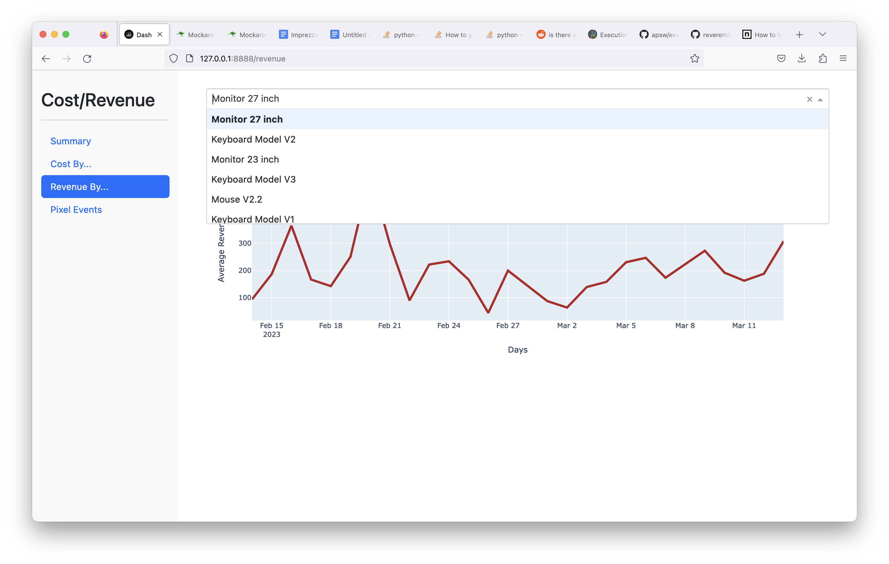

# imprezza_reports

The following files were created by mockaroo to simulate the 
data returned from API calls and transformed into tables:

  * cpc_event.csv
  * product_line_item_sale.csv
  * order_sample.csv
  * pixel_event.csv

The main file here is report.py which can be run simply:
`python report.py`.

To properly run this, start a virtual environment, and
`pip install -r requirements.txt`.

There is a file called init-db.sh that must be run to create
the sqlite file imprezza-report.db before the app must be run.

# Screenshot

